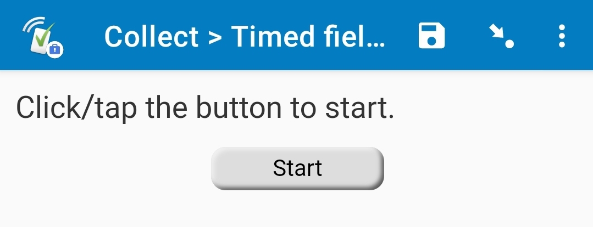

# Button to advance

## Description

Use this field plug-in to move to the next field by either clicking/tapping a button, or pressing a keyboard key. By default, that key is the spacebar, but it can be customized with the parameters.

This field has no value until that key is pressed. When the key is pressed, this field is given a value of `1`. When the button is clicked, it is given a value of `2`. So, if it is fine for the respondent to swipe or use the arrows to move to the next field, make the *required* value of the field blank or `no`. If the respondent must use the specified key or a button, make the *required* value of the field `yes`.

*This plug-in is currently under beta. If you you find a problem with the field plug-in, please email max@surveycto.com.*

## Default SurveyCTO feature support

| Feature / Property | Support |
| --- | --- |
| Supported field type(s) | `text`|
| Default values | No |
| Custom constraint message | No |
| Custom required message | No |
| Read only | No |
| media:image | Yes |
| media:audio | Yes |
| media:video | Yes |
| `number` appearance | No |
| `numbers_decimal` appearance | No |
| `numbers_phone` appearance | No |
| `show_formatted` appearance | No |

## How to use

**To use this field plug-in as-is**, just download the [button-to-advance.fieldplugin.zip](https://github.com/surveycto/button-to-advance/raw/master/button-to-advance.fieldplugin.zip) file from this repo, and attach it to your form.

## Parameters

|Name|Description|Default|
|---|---|---|
|`allowback`|Whether the respondent can return to this field. By default, if a respondent attempts to return to this field (such as by swiping back), then this field will auto-advance, and bring them back to the field they were on. This is helpful for timed tests, such as EGRA tests or implicit association tests (IAT), since if the respondent's finger slips, and they accidentally swipe back, they will be brought back so they can easily continue. If this field has a value of `1`, then the respondent can return to this field, and it will not auto-advance them.|`0`|
|`buttontext`|Text on the start button.|`Start`|
|`key`|Key to press to advance to the next field. Make sure it is in single quotes, and lowercase. If you would like the respondent to only be able to advance by tapping/clicking the button, give this dield a value of `'None'`.|(spacebar)|
|`nobutton`|Whether or not the button on the screen will be hidden. By default, the button will always be shown. If this parameter has a value of `1`, then the button will be hidden, and the respondent can only advance using the specified keyboard key.|`0`|

## More resources

* **Sample form**  
You can try this out with the sample form for the [timed-field-list](https://github.com/surveycto/timed-field-list) field plug-in.

* **Developer documentation**  
More instructions for developing and using field plug-ins can be found here: [https://github.com/surveycto/Field-plug-in-resources](https://github.com/surveycto/Field-plug-in-resources)
